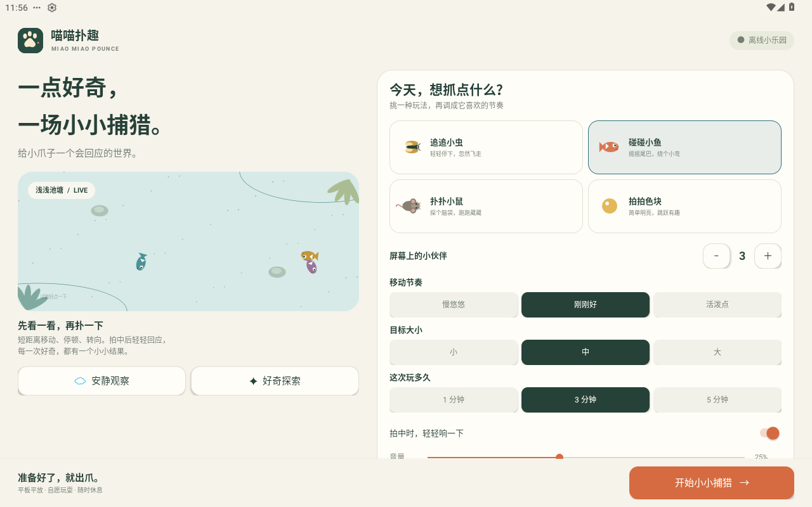
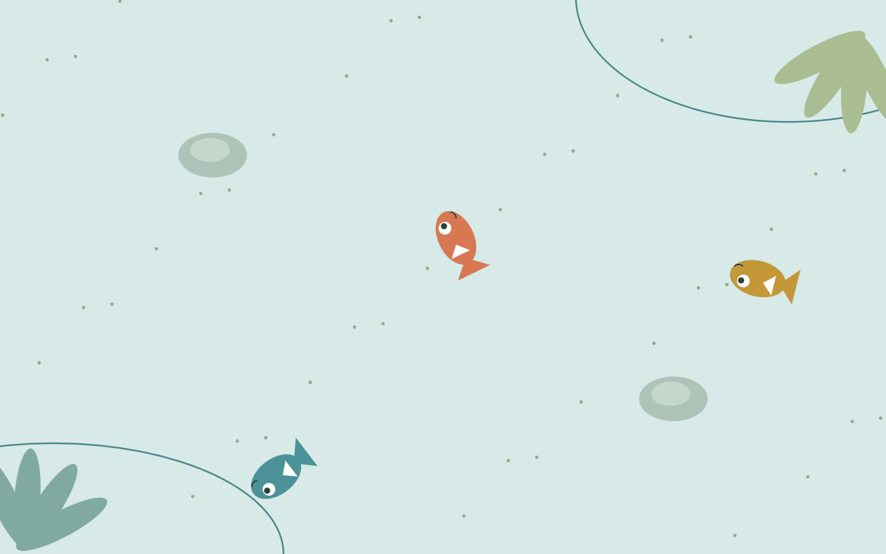
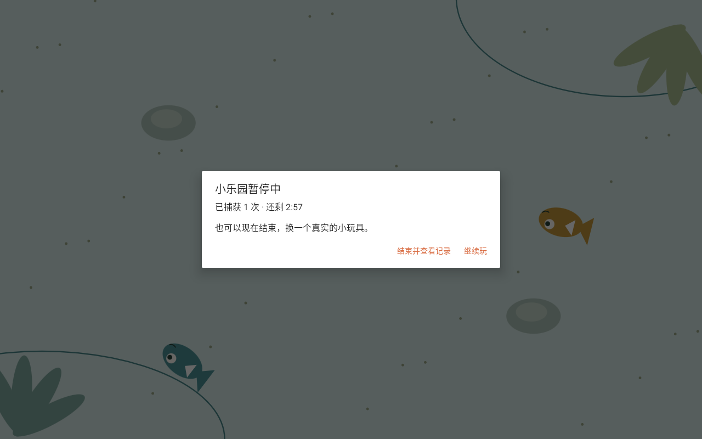
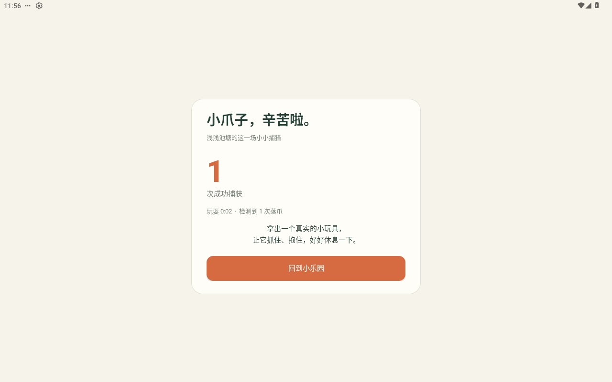
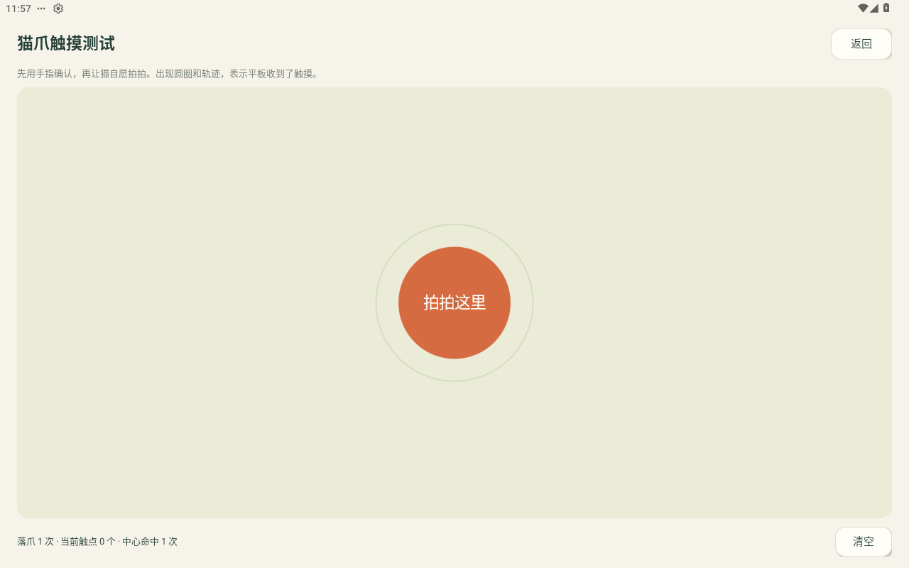

# v1.0.0 验收报告

验收日期：2026-10-07。范围：安卓软件构建、模拟器交互、实际签名 Release APK 安装与界面点击。小米真机和猫咪兴趣验证留给实际设备试用，不计入软件通过结果。

## 软件验收

| 项目 | 结果 | 验证内容 |
|---|---|---|
| Debug / Release 构建 | 通过 | Kotlin 编译、资源处理、R8 优化、APK 打包 |
| 逻辑测试 | 10 / 10 通过 | 命中与未命中、宽松判定、两触点、重复命中保护、延迟刷新、避开按住区域、计时终止、旋转缩放、四主题和三档速度边界、隐藏目标、非法输入 |
| 安卓交互测试 | 7 / 7 通过 | 四主题实际画面与落爪、设置跨重启保存、触摸诊断与清空、自然到时单次记录、长按主人入口及可见答案列表、原生双指事件、旋转和短暂后台中断的暂停确认 |
| Android Lint | 0 错误 | 未禁用错误检测；保留固定依赖版本提示、中文文本国际化建议和可选 KTX 建议等非阻断警告 |
| Release 签名 | 通过 | 独立 RSA 3072 位证书，APK Signature Scheme v2；最低 API 26 |
| Release 冷启动 | 通过 | 在模拟器上安装并真实启动优化后的正式 APK |
| Release 点击捕获 | 通过 | 从屏幕截图定位实际小鱼后，用 ADB 输入触摸；暂停与结果页面确认产生成功捕获 |
| Release 后台 / 返回 | 通过 | 按 Home 离开，返回应用显示暂停确认，不自动继续 |
| Release 主人退出 | 通过 | 系统返回键进入题目，真实点击可见答案，再结束并显示结果 |
| Release 触摸诊断 | 通过 | 实际点击显示一次落爪和中心命中，清空后归零 |
| 大屏布局 | 通过 | 1280×800 横屏与 800×1280 竖屏截图；开始按钮保持在底部，长内容可以滚动 |
| 权限检查 | 通过 | 没有 INTERNET / CAMERA / RECORD_AUDIO / 外部存储权限；AndroidX 仅声明自身非导出接收器保护权限 |

本地环境：MuMu，Android 12 / API 31；JDK 21、SDK 36、Build Tools 35.0.0。测试结果和 APK 校验值见 [机器可读结果](test-results.json)。

```text
gradle testDebugUnitTest assembleDebug assembleRelease lintDebug connectedDebugAndroidTest
BUILD SUCCESSFUL
```

GitHub 工作流额外配置 Android 12 / API 31 与 Android 16 / API 36 的平板模拟器测试，运行状态以仓库 Actions 为准，不能把“已配置”当作“已通过”。

## 真实界面







## 待真机确认

- 用户提供的小米平板上，真实猫爪是否可靠触发触摸。
- HyperOS 屏幕固定的入口、确认和系统解除手势。
- 扬声器的实际听感、触摸与声音延迟、持续运行发热。
- 具体猫咪是否愿意观察、主动出爪以及再次参与。

执行步骤见 [真机验收清单](TABLET_CHECKLIST.md)。屏幕玩法不能代替实际抓握；建议短场次并配合实体玩具。
